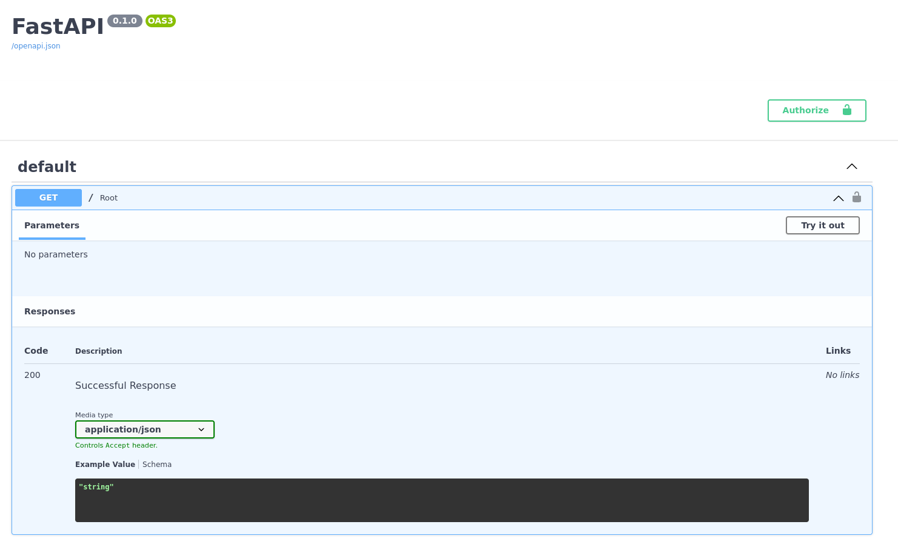
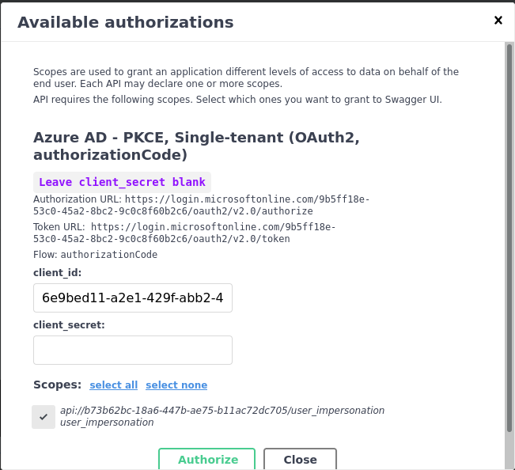

<h1 align="center">
  
  <br/>
  FastAPI-Azure-Auth
</h1>

<p align="center">
    <em>Azure AD Authentication for FastAPI apps made easy.</em>
</p>
<p align="center">
    <!-- Line 1 -->
    <a href="https://python.org">
        
    </a>
    <a href="https://fastapi.tiangolo.com/">
        
    </a>
    <a href="https://pypi.org/pypi/fastapi-azure-auth">
        
    </a>
    <!-- Line 2 -->
    <br/>
    <a href="https://codecov.io/gh/intility/fastapi-azure-auth">
        
    </a>
    <a href="https://github.com/pre-commit/pre-commit">
        
    </a>
    <a href="https://github.com/psf/black">
        
    </a>
    <a href="http://mypy-lang.org">
        
    </a>
    <a href="https://pycqa.github.io/isort/">
        
    </a>
    <!-- Line 3 -->
    <br/>
    <a href="https://docs.microsoft.com/en-us/azure/active-directory/develop/single-and-multi-tenant-apps">
        
    </a>
    <a href="https://docs.microsoft.com/en-us/azure/active-directory/develop/single-and-multi-tenant-apps">
        
    </a>
</p>


## 🚀 Description

> FastAPI is a modern, fast (high-performance), web framework for building APIs with Python, based on standard Python type hints.

At Intility we use FastAPI for both internal (single-tenant) and customer-facing (multi-tenant) APIs. This package enables our developers (and you 😊) to create features without worrying about authentication and authorization.

Also, [we're hiring!](https://intility.no/en/career/)

## 📚 Resources

The [documentation](https://intility.github.io/fastapi-azure-auth/) contains a full tutorial on how to configure Azure AD
and FastAPI for both single- and multi-tenant applications. It includes examples on how to lock down
your APIs to certain scopes, tenants, roles etc. For first time users it's strongly advised to set up your
application exactly how it's described there, and then alter it to your needs later.

[**MIT License**](https://github.com/Intility/fastapi-azure-auth/blob/main/LICENSE)
| [**Documentation**](https://intility.github.io/fastapi-azure-auth/)
| [**GitHub**](https://github.com/snok/django-guid)


## ⚡ Setup

This is a tl;dr intended to give you an idea of what this package does and how to use it.
For a more in-depth tutorial and settings reference you should read the
[documentation](https://intility.github.io/fastapi-azure-auth/).


#### 1. Install this library:
```bash
pip install fastapi-azure-auth
# or
poetry add fastapi-azure-auth
```

#### 2. Configure your FastAPI app
Include `swagger_ui_oauth2_redirect_url` and `swagger_ui_init_oauth` in your FastAPI app initialization:

```python
# file: main.py
app = FastAPI(
    ...
    swagger_ui_oauth2_redirect_url='/oauth2-redirect',
    swagger_ui_init_oauth={
        'usePkceWithAuthorizationCodeGrant': True,
        'clientId': settings.OPENAPI_CLIENT_ID,
    },
)
```

#### 3. Setup CORS
Ensure you have CORS enabled for your local environment, such as `http://localhost:8000`.

#### 4. Configure FastAPI-Azure-Auth
Configure either your [`SingleTenantAzureAuthorizationCodeBearer`](https://intility.github.io/fastapi-azure-auth/settings/single_tenant)
or [`MultiTenantAzureAuthorizationCodeBearer`](https://intility.github.io/fastapi-azure-auth/settings/multi_tenant).


```python
# file: demoproj/api/dependencies.py
from fastapi_azure_auth.auth import SingleTenantAzureAuthorizationCodeBearer

azure_scheme = SingleTenantAzureAuthorizationCodeBearer(
    app_client_id=settings.APP_CLIENT_ID,
    tenant_id=settings.TENANT_ID,
    scopes={
        f'api://{settings.APP_CLIENT_ID}/user_impersonation': 'user_impersonation',
    }
)
```
or for multi-tenant applications:
```python
# file: demoproj/api/dependencies.py
from fastapi_azure_auth.auth import MultiTenantAzureAuthorizationCodeBearer

azure_scheme = MultiTenantAzureAuthorizationCodeBearer(
    app_client_id=settings.APP_CLIENT_ID,
    scopes={
        f'api://{settings.APP_CLIENT_ID}/user_impersonation': 'user_impersonation',
    },
    validate_iss=False
)
```
To validate the `iss`, configure an
[`iss_callable`](https://intility.github.io/fastapi-azure-auth/multi-tenant/accept_specific_tenants_only).

#### 5. Configure dependencies

Add `azure_scheme` as a dependency for your views/routers, using either `Security()` or `Depends()`.
```python
# file: main.py
from demoproj.api.dependencies import azure_scheme

app.include_router(api_router, prefix=settings.API_V1_STR, dependencies=[Security(azure_scheme, scopes=['user_impersonation'])])
```

#### 6. Load config on startup

Optional but recommended.

```python
# file: main.py
@app.on_event('startup')
async def load_config() -> None:
    """
    Load OpenID config on startup.
    """
    await azure_scheme.openid_config.load_config()
```


## 📄 Example OpenAPI documentation
Your OpenAPI documentation will get an `Authorize` button, which can be used to authenticate.


The user can select which scopes to authenticate with, based on your configuration.

