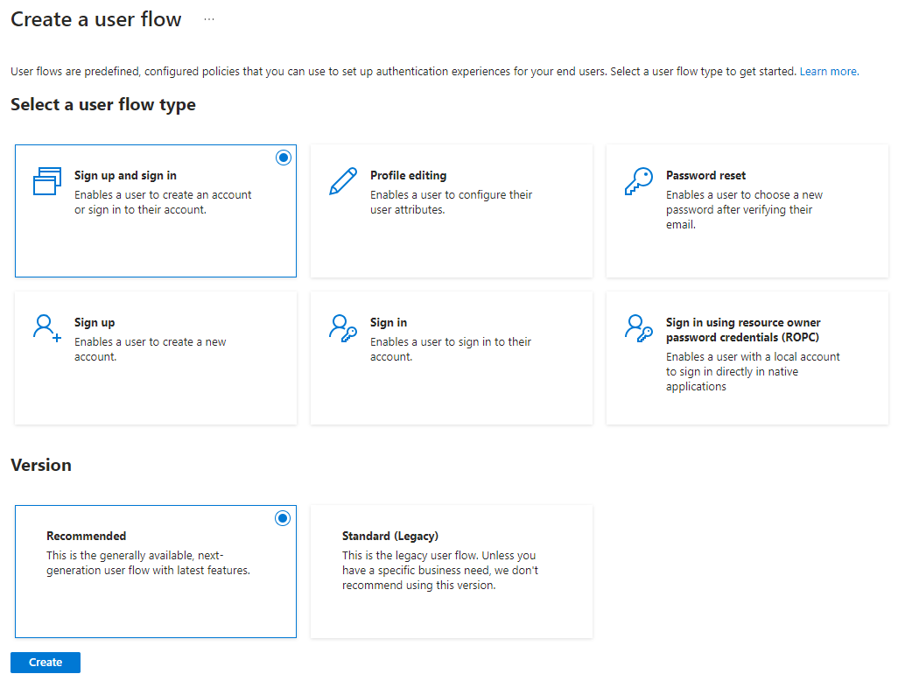

We'll need to create two application registrations for Azure AD B2C authentication to cover both direct API
use and usage from the OpenAPI (swagger) documentation.

:::info
This guide assumes that an Azure B2C tenant was already created and linked to an Azure subscription.
:::


## Backend API

### Step 1 - Create app registration
Head over to
[Azure -> Azure AD B2C -> App registrations](https://portal.azure.com/#view/Microsoft_AAD_B2CAdmin/TenantManagementMenuBlade/~/registeredApps),
and create a new registration.

Select a fitting name for your project; Azure will present the name to the user during consent.

* `Supported account types`: `Accounts in any identity provider or organizational directory (for authenticating users with user flows)`
* `Redirect URI`: Choose `Web` and `http://localhost:8000/signin-oidc` as a value
* `Grant admin consent to openid and offline_access permissions`: `Yes`

Press **Register**


### Step 2 - Verify token version is `v2`

First we'll verify that the token version is version 2. In the left menu bar, click `Manifest` and find the line
that says `accessTokenAcceptedVersion`. Verify that the value is `2`.

Press **Save**

(A change can take some time to happen, which is why we do this first.)


### Step 3 - Note down your tenant name and application ID

Go back to the App Registration `Overview`, found in the left menu.


Copy the `Application (Client) ID`, we'll need it for later. I like to use `.env` files to
store variables like these:

```bash title=".env" {2}
TENANT_NAME=
APP_CLIENT_ID=
OPENAPI_CLIENT_ID=
AUTH_POLICY_NAME=
```

Also, in the Azure AD B2C overview get the tenant name from the domain name (without the `.onmicrosoft.com` part)
and add it to the `.env` file as well:

```bash title=".env" {1}
TENANT_NAME=
APP_CLIENT_ID=
OPENAPI_CLIENT_ID=
AUTH_POLICY_NAME=
```


### Step 4 - Add an application scope

1. Go to **Expose an API** in the left menu bar under your app registration.
2. Press **+ Add a scope**
3. You'll be prompted to set an Application ID URI, leave the suggested one and press **Save and continue**


4. You'll be prompted to set a scope name, display name and description. Set the scope name to `user_impersonation`,
display name to `Access API as user` and description to `Allows the app to access the API as the user.`
5. Make sure the State is `Enabled`
6. Press **Add scope**


## OpenAPI Documentation
Our OpenAPI documentation will use the `Authorization Code Grant Flow, with Proof Key for Code Exchange` flow.
It's a flow that enables a user of a Single-Page Application to safely log in, consent to permissions and fetch an `access_token`
in the `JWT` format. When the user clicks `Try out` on the APIs, the `access_token` is attached to the header as a `Bearer ` token.
This is the token the backend will validate.

So, let's set it up!

### Step 1 - Create app registration
Just like in the previous chapter, we have to create an application registration for our OpenAPI.

Head over to
[Azure -> Azure AD B2C -> App registrations](https://portal.azure.com/#view/Microsoft_AAD_B2CAdmin/TenantManagementMenuBlade/~/registeredApps),
and create a new registration.

Use the same name, but with `- OpenAPI` appended to it.

* `Supported account types`: `Accounts in any identity provider or organizational directory (for authenticating users with user flows)`
* `Redirect URI`: Choose `Single-Page Application (SPA)` and `http://localhost:8000/oauth2-redirect` as a value
* `Grant admin consent to openid and offline_access permissions`: `Yes`

Press **Register**


### Step 2 - Change token version to `v2`

Like last time, we'll verify the token version is set to version 2. In the left menu bar, click `Manifest` and find the line
that says `accessTokenAcceptedVersion`. Verify the value is `2`.

Press **Save**


### Step 3 - Note down your application IDs
Go back to the `Overview`, found in the left menu.

Copy the `Application (Client) ID` and save it as your `OPENAPI_CLIENT_ID`:

```bash title=".env" {3}
TENANT_NAME=
APP_CLIENT_ID=
OPENAPI_CLIENT_ID=
AUTH_POLICY_NAME=
````


### Step 4 - Allow OpenAPI to talk to the backend

To allow OpenAPI to talk to the backend API, you must add API permissions to the OpenAPI app registration.
In the left menu, go to **API Permissions** and **Add a permission**.


Select the `user_impersonation` scope, and press **Add a permission**.

Your view should now look something like this:


That's it! Next step is to configure the FastAPI application.


## User flows

### Step 1 - Create a user flow

Head over to
[Azure -> Azure AD B2C -> Users flows](https://portal.azure.com/#view/Microsoft_AAD_B2CAdmin/TenantManagementMenuBlade/~/userJourneys),
and create a new user flow.

Select a user flow type of `Sign up and sign in` with the Version `Recommended`, then press **Create**.



You are prompted to fill out details of the new user flow.

Give it a name of `sign_up_sign_in` (note that `B2C_1_` is already prefixed), and choose `Email signup` as the identity provider.


Keep all defaults for now and choose user attributes and token claims as required, and press **Create**


### Step 2 - Note down your User flow name

Copy the User Flow name just created (including the `B2C_1_` prefix, e.g. `B2C_1_sign_up_sign_in`)
and save it in the .env file:

```bash title=".env" {4}
TENANT_NAME=
APP_CLIENT_ID=
OPENAPI_CLIENT_ID=
AUTH_POLICY_NAME=B2C_1_sign_up_sign_in
````

That's it! Next step is to configure the FastAPI application.
