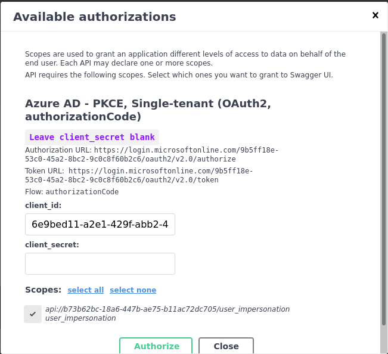

import GitHubButton from 'react-github-btn';

We'll do the **simplest setup possible** in these docs, through a one-file `main.py`.
However, it's highly recommended that you read the chapters about bigger applications
[here](https://fastapi.tiangolo.com/tutorial/bigger-applications/), and invest in a good project structure.

We assume you've done the FastAPI tutorial and have dependencies installed, such as `FastAPI` and `Gunicorn`.

For a more "real life" project example, look at the
[demo_project](https://github.com/Intility/fastapi-azure-auth/tree/main/demo_project) on GitHub.

## Getting started
First, either create your `.env` file and fill out your variables or insert them directly in your settings later.

```bash title=".env"
TENANT_NAME=
APP_CLIENT_ID=
OPENAPI_CLIENT_ID=
AUTH_POLICY_NAME=
```

Create your `main.py` file:

```python title="main.py"
from fastapi import FastAPI
import uvicorn

app = FastAPI()


@app.get("/")
async def root():
    return {"message": "Hello World"}

if __name__ == '__main__':
    uvicorn.run('main:app', reload=True)
```
Run your application and ensure that everything works on [http://localhost:8000/docs](http://localhost:8000/docs)

:::info
You need to run the application on the configured port in Azure AD B2C for the next steps to work! If you are unsure,
revisit the previous chapter or review the Azure AD B2C configuration under `App Registrations` -> `Authentication`.
:::

## Add your settings

First, add your settings to the application. We'll need these later. The way I've set it up will look for a `.env`-file
to populate your settings, but you can also just set a `default` value directly.

```python {3-4,7-19} title="main.py"
import uvicorn
from fastapi import FastAPI
from pydantic import AnyHttpUrl
from pydantic_settings import BaseSettings, SettingsConfigDict


class Settings(BaseSettings):
    BACKEND_CORS_ORIGINS: list[str | AnyHttpUrl] = ['http://localhost:8000']
    TENANT_NAME: str = ""
    APP_CLIENT_ID: str = ""
    OPENAPI_CLIENT_ID: str = ""
    AUTH_POLICY_NAME: str = ""
    SCOPE_DESCRIPTION: str = "user_impersonation"

    model_config = SettingsConfigDict(
        env_file='.env',
        env_file_encoding='utf-8',
        case_sensitive=True
    )

settings = Settings()

app = FastAPI()

@app.get("/")
async def root():
    return {"message": "Hello World"}


if __name__ == '__main__':
    uvicorn.run('main:app', reload=True)
```

## Configure `CORS`

Now, let's configure our `CORS`. Without `CORS` your OpenAPI docs won't work as expected:

```python {3,26-33} title="main.py"
import uvicorn
from fastapi import FastAPI
from fastapi.middleware.cors import CORSMiddleware
from pydantic import AnyHttpUrl
from pydantic_settings import BaseSettings, SettingsConfigDict


class Settings(BaseSettings):
    BACKEND_CORS_ORIGINS: list[str | AnyHttpUrl] = ['http://localhost:8000']
    TENANT_NAME: str = ""
    APP_CLIENT_ID: str = ""
    OPENAPI_CLIENT_ID: str = ""
    AUTH_POLICY_NAME: str = ""
    SCOPE_DESCRIPTION: str = "user_impersonation"

    model_config = SettingsConfigDict(
        env_file='.env',
        env_file_encoding='utf-8',
        case_sensitive=True
    )

settings = Settings()

app = FastAPI()

if settings.BACKEND_CORS_ORIGINS:
    app.add_middleware(
        CORSMiddleware,
        allow_origins=[str(origin) for origin in settings.BACKEND_CORS_ORIGINS],
        allow_credentials=True,
        allow_methods=['*'],
        allow_headers=['*'],
    )


@app.get("/")
async def root():
    return {"message": "Hello World"}


if __name__ == '__main__':
    uvicorn.run('main:app', reload=True)
```

## Configure OpenAPI Documentation
In order for our OpenAPI documentation to work, we have to configure a few settings directly in the `FastAPI` application.

```python {24-30} title="main.py"
import uvicorn
from fastapi import FastAPI
from fastapi.middleware.cors import CORSMiddleware
from pydantic import AnyHttpUrl
from pydantic_settings import BaseSettings, SettingsConfigDict


class Settings(BaseSettings):
    BACKEND_CORS_ORIGINS: list[str | AnyHttpUrl] = ['http://localhost:8000']
    TENANT_NAME: str = ""
    APP_CLIENT_ID: str = ""
    OPENAPI_CLIENT_ID: str = ""
    AUTH_POLICY_NAME: str = ""
    SCOPE_DESCRIPTION: str = "user_impersonation"

    model_config = SettingsConfigDict(
        env_file='.env',
        env_file_encoding='utf-8',
        case_sensitive=True
    )

settings = Settings()

app = FastAPI(
    swagger_ui_oauth2_redirect_url='/oauth2-redirect',
    swagger_ui_init_oauth={
        'usePkceWithAuthorizationCodeGrant': True,
        'clientId': settings.OPENAPI_CLIENT_ID,
    },
)

if settings.BACKEND_CORS_ORIGINS:
    app.add_middleware(
        CORSMiddleware,
        allow_origins=[str(origin) for origin in settings.BACKEND_CORS_ORIGINS],
        allow_credentials=True,
        allow_methods=['*'],
        allow_headers=['*'],
    )


@app.get("/")
async def root():
    return {"message": "Hello World"}


if __name__ == '__main__':
    uvicorn.run('main:app', reload=True)
```

The `swagger_ui_oauth2_redirect_url` setting for redirect should be as configured in Azure AD.
The `swagger_ui_init_oauth` are standard mapped OpenAPI properties. You can find documentation about them [here](https://swagger.io/docs/open-source-tools/swagger-ui/usage/oauth2/)

We've used two flags: `usePkceWithAuthorizationCodeGrant`, which is the authentication flow.
`clientId` is our application Client ID, which will autofill a field for the end users later.

## Implementing FastAPI-Azure-Auth

Now, the fun part begins! 🚀

Import the `B2CMultiTenantAuthorizationCodeBearer` from `fastapi_azure_auth` and configure it. You can use the `Settings` class to compute the required fields:


```python {4,6,17-42,70-77} title="main.py"
import uvicorn
from fastapi import FastAPI
from fastapi.middleware.cors import CORSMiddleware
from pydantic import AnyHttpUrl, computed_field
from pydantic_settings import BaseSettings, SettingsConfigDict
from fastapi_azure_auth import B2CMultiTenantAuthorizationCodeBearer


class Settings(BaseSettings):
    BACKEND_CORS_ORIGINS: list[str | AnyHttpUrl] = ['http://localhost:8000']
    TENANT_NAME: str = ""
    APP_CLIENT_ID: str = ""
    OPENAPI_CLIENT_ID: str = ""
    AUTH_POLICY_NAME: str = ""
    SCOPE_DESCRIPTION: str = "user_impersonation"

    @computed_field
    @property
    def SCOPE_NAME(self) -> str:
        return f'https://{self.TENANT_NAME}.onmicrosoft.com/{self.APP_CLIENT_ID}/{self.SCOPE_DESCRIPTION}'

    @computed_field
    @property
    def SCOPES(self) -> dict:
        return {
            self.SCOPE_NAME: self.SCOPE_DESCRIPTION
        }

    @computed_field
    @property
    def OPENID_CONFIG_URL(self) -> dict:
        return f'https://{self.TENANT_NAME}.b2clogin.com/{self.TENANT_NAME}.onmicrosoft.com/{self.AUTH_POLICY_NAME}/v2.0/.well-known/openid-configuration'

    @computed_field
    @property
    def OPENAPI_AUTHORIZATION_URL(self) -> dict:
        return f'https://{settings.TENANT_NAME}.b2clogin.com/{settings.TENANT_NAME}.onmicrosoft.com/{settings.AUTH_POLICY_NAME}/oauth2/v2.0/authorize'

    @computed_field
    @property
    def OPENAPI_TOKEN_URL(self) -> dict:
        return f'https://{settings.TENANT_NAME}.b2clogin.com/{settings.TENANT_NAME}.onmicrosoft.com/{settings.AUTH_POLICY_NAME}/oauth2/v2.0/token'

    model_config = SettingsConfigDict(
        env_file='.env',
        env_file_encoding='utf-8',
        case_sensitive=True
    )

settings = Settings()

app = FastAPI(
    swagger_ui_oauth2_redirect_url='/oauth2-redirect',
    swagger_ui_init_oauth={
        'usePkceWithAuthorizationCodeGrant': True,
        'clientId': settings.OPENAPI_CLIENT_ID,
        'scopes': settings.SCOPE_NAME,
    },
)

if settings.BACKEND_CORS_ORIGINS:
    app.add_middleware(
        CORSMiddleware,
        allow_origins=[str(origin) for origin in settings.BACKEND_CORS_ORIGINS],
        allow_credentials=True,
        allow_methods=['*'],
        allow_headers=['*'],
    )

azure_scheme = B2CMultiTenantAuthorizationCodeBearer(
    app_client_id=settings.APP_CLIENT_ID,
    openid_config_url=settings.OPENID_CONFIG_URL,
    openapi_authorization_url=settings.OPENAPI_AUTHORIZATION_URL,
    openapi_token_url=settings.OPENAPI_TOKEN_URL,
    scopes=settings.SCOPES,
    validate_iss=False,
)


@app.get("/")
async def root():
    return {"message": "Hello World"}


if __name__ == '__main__':
    uvicorn.run('main:app', reload=True)
```

We pass the `app_client_id=` to be our Backend application ID.
The `openid_config_url` is composed of our Tenant Name and the Policy name given as a user flow. Lastly our
scope(s) are composed of the Tenant name as well as the Backend application ID. We'll get back to the scopes later.

## Add loading of OpenID Configuration on startup

By adding `on_event('startup')` we're able to load the OpenID configuration immediately, instead of doing it when
the first user authenticates. This isn't required, but makes things a bit quicker. When 24 hours has passed, the
configuration will be considered out of date, and update when a user does a request. You can use
[background tasks](https://fastapi.tiangolo.com/tutorial/background-tasks/) to refresh it before that happens if you'd like.

```python {80-85} title="main.py"
import uvicorn
from fastapi import FastAPI
from fastapi.middleware.cors import CORSMiddleware
from pydantic import AnyHttpUrl, computed_field
from pydantic_settings import BaseSettings, SettingsConfigDict
from fastapi_azure_auth import B2CMultiTenantAuthorizationCodeBearer


class Settings(BaseSettings):
    BACKEND_CORS_ORIGINS: list[str | AnyHttpUrl] = ['http://localhost:8000']
    TENANT_NAME: str = ""
    APP_CLIENT_ID: str = ""
    OPENAPI_CLIENT_ID: str = ""
    AUTH_POLICY_NAME: str = ""
    SCOPE_DESCRIPTION: str = "user_impersonation"

    @computed_field
    @property
    def SCOPE_NAME(self) -> str:
        return f'https://{self.TENANT_NAME}.onmicrosoft.com/{self.APP_CLIENT_ID}/{self.SCOPE_DESCRIPTION}'

    @computed_field
    @property
    def SCOPES(self) -> dict:
        return {
            self.SCOPE_NAME: self.SCOPE_DESCRIPTION
        }

    @computed_field
    @property
    def OPENID_CONFIG_URL(self) -> dict:
        return f'https://{self.TENANT_NAME}.b2clogin.com/{self.TENANT_NAME}.onmicrosoft.com/{self.AUTH_POLICY_NAME}/v2.0/.well-known/openid-configuration'

    @computed_field
    @property
    def OPENAPI_AUTHORIZATION_URL(self) -> dict:
        return f'https://{settings.TENANT_NAME}.b2clogin.com/{settings.TENANT_NAME}.onmicrosoft.com/{settings.AUTH_POLICY_NAME}/oauth2/v2.0/authorize'

    @computed_field
    @property
    def OPENAPI_TOKEN_URL(self) -> dict:
        return f'https://{settings.TENANT_NAME}.b2clogin.com/{settings.TENANT_NAME}.onmicrosoft.com/{settings.AUTH_POLICY_NAME}/oauth2/v2.0/token'

    model_config = SettingsConfigDict(
        env_file='.env',
        env_file_encoding='utf-8',
        case_sensitive=True
    )

settings = Settings()

app = FastAPI(
    swagger_ui_oauth2_redirect_url='/oauth2-redirect',
    swagger_ui_init_oauth={
        'usePkceWithAuthorizationCodeGrant': True,
        'clientId': settings.OPENAPI_CLIENT_ID,
        'scopes': settings.SCOPE_NAME,
    },
)

if settings.BACKEND_CORS_ORIGINS:
    app.add_middleware(
        CORSMiddleware,
        allow_origins=[str(origin) for origin in settings.BACKEND_CORS_ORIGINS],
        allow_credentials=True,
        allow_methods=['*'],
        allow_headers=['*'],
    )

azure_scheme = B2CMultiTenantAuthorizationCodeBearer(
    app_client_id=settings.APP_CLIENT_ID,
    openid_config_url=settings.OPENID_CONFIG_URL,
    openapi_authorization_url=settings.OPENAPI_AUTHORIZATION_URL,
    openapi_token_url=settings.OPENAPI_TOKEN_URL,
    scopes=settings.SCOPES,
    validate_iss=False,
)


@app.on_event('startup')
async def load_config() -> None:
    """
    Load OpenID config on startup.
    """
    await azure_scheme.openid_config.load_config()


@app.get("/")
async def root():
    return {"message": "Hello World"}


if __name__ == '__main__':
    uvicorn.run('main:app', reload=True)
```

## Adding authentication to our view
There's two ways of adding dependencies in FastAPI. You can use `Depends()` or `Security()`. `Security()` has an extra
property called `scopes`. `FastAPI-Azure-Auth` support both, but if you use `Security()` you can also lock down your API
views based on the scope.

Let's do that:

```python {2,88} title="main.py"
import uvicorn
from fastapi import FastAPI, Security
from fastapi.middleware.cors import CORSMiddleware
from pydantic import AnyHttpUrl, computed_field
from pydantic_settings import BaseSettings, SettingsConfigDict
from fastapi_azure_auth import B2CMultiTenantAuthorizationCodeBearer


class Settings(BaseSettings):
    BACKEND_CORS_ORIGINS: list[str | AnyHttpUrl] = ['http://localhost:8000']
    TENANT_NAME: str = ""
    APP_CLIENT_ID: str = ""
    OPENAPI_CLIENT_ID: str = ""
    AUTH_POLICY_NAME: str = ""
    SCOPE_DESCRIPTION: str = "user_impersonation"

    @computed_field
    @property
    def SCOPE_NAME(self) -> str:
        return f'https://{self.TENANT_NAME}.onmicrosoft.com/{self.APP_CLIENT_ID}/{self.SCOPE_DESCRIPTION}'

    @computed_field
    @property
    def SCOPES(self) -> dict:
        return {
            self.SCOPE_NAME: self.SCOPE_DESCRIPTION
        }

    @computed_field
    @property
    def OPENID_CONFIG_URL(self) -> dict:
        return f'https://{self.TENANT_NAME}.b2clogin.com/{self.TENANT_NAME}.onmicrosoft.com/{self.AUTH_POLICY_NAME}/v2.0/.well-known/openid-configuration'

    @computed_field
    @property
    def OPENAPI_AUTHORIZATION_URL(self) -> dict:
        return f'https://{settings.TENANT_NAME}.b2clogin.com/{settings.TENANT_NAME}.onmicrosoft.com/{settings.AUTH_POLICY_NAME}/oauth2/v2.0/authorize'

    @computed_field
    @property
    def OPENAPI_TOKEN_URL(self) -> dict:
        return f'https://{settings.TENANT_NAME}.b2clogin.com/{settings.TENANT_NAME}.onmicrosoft.com/{settings.AUTH_POLICY_NAME}/oauth2/v2.0/token'

    model_config = SettingsConfigDict(
        env_file='.env',
        env_file_encoding='utf-8',
        case_sensitive=True
    )

settings = Settings()

app = FastAPI(
    swagger_ui_oauth2_redirect_url='/oauth2-redirect',
    swagger_ui_init_oauth={
        'usePkceWithAuthorizationCodeGrant': True,
        'clientId': settings.OPENAPI_CLIENT_ID,
        'scopes': settings.SCOPE_NAME,
    },
)

if settings.BACKEND_CORS_ORIGINS:
    app.add_middleware(
        CORSMiddleware,
        allow_origins=[str(origin) for origin in settings.BACKEND_CORS_ORIGINS],
        allow_credentials=True,
        allow_methods=['*'],
        allow_headers=['*'],
    )

azure_scheme = B2CMultiTenantAuthorizationCodeBearer(
    app_client_id=settings.APP_CLIENT_ID,
    openid_config_url=settings.OPENID_CONFIG_URL,
    openapi_authorization_url=settings.OPENAPI_AUTHORIZATION_URL,
    openapi_token_url=settings.OPENAPI_TOKEN_URL,
    scopes=settings.SCOPES,
    validate_iss=False,
)


@app.on_event('startup')
async def load_config() -> None:
    """
    Load OpenID config on startup.
    """
    await azure_scheme.openid_config.load_config()


@app.get("/", dependencies=[Security(azure_scheme)])
async def root():
    return {"message": "Hello World"}


if __name__ == '__main__':
    uvicorn.run('main:app', reload=True)
```

## Testing it out

Head over to your OpenAPI documentation at [http://localhost:8000/docs](http://localhost:8000/docs) and check out your API documentation.
You'll see a new button called `Authorize`. Before clicking it, try out your API to see that you're unauthorized.


Now, let's authenticate. Click the **Authorize** button. Check your scope, and leave `Client secret` blank. You do not
need that with the PKCE flow.




Consent to the permissions requested:


:::info
If you get a warning that your redirect URL is wrong, you're probably using `127.0.0.1` instead of `localhost`
:::

Try out your API again to see that it works!

### Last thing..

As discussed earlier, there is a `scope` parameter to the `Security()` version of `Depends()`. If you'd want to lock down
your API to only be accessible by those with certain scopes, you can simply pass it into the dependency.

```python
@app.get("/", dependencies=[Security(azure_scheme, scopes=['wrong_scope'])])
```
If you do this and try out your API again, you'll see that you're denied.


Your users are now safe and secure! Good luck! 🔒🚀

<div style={{textAlign: 'center'}}>
  <h4>If you like this project, please leave us a star ❤ ️️</h4>

  <GitHubButton
    href="https://github.com/intility/fastapi-azure-auth"
    data-color-scheme="no-preference: dark_dimmed; light: dark_dimmed; dark: dark_dimmed;"
    data-icon="octicon-star" data-size="large" data-show-count="true"
    aria-label="Star intility/fastapi-azure-auth on GitHub">
    Star
  </GitHubButton>
</div>
