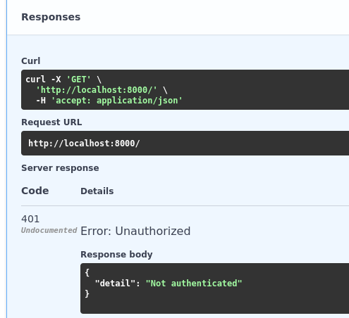
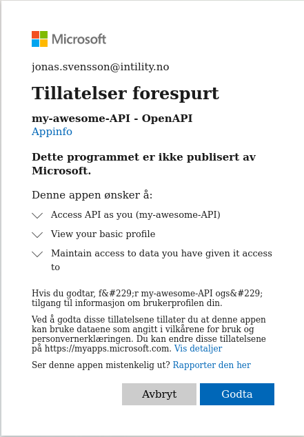

import GitHubButton from 'react-github-btn';

We'll do the **simplest setup possible** in these docs, through a one-file `main.py`.
However, it's highly recommended that you read the chapters about bigger applications
[here](https://fastapi.tiangolo.com/tutorial/bigger-applications/), and invest in a good project structure.

We assume you've done the FastAPI tutorial and have dependencies installed, such as `FastAPI` and `Gunicorn`.

For a more "real life" project example, look at the
[demo_project](https://github.com/Intility/fastapi-azure-auth/tree/main/demo_project) on GitHub. This is configured
as a single-tenant, but can easily be converted into a multi-tenant if you follow along here.

## Getting started
First, either create your `.env` file and fill out your variables or insert them directly in your settings later.

```bash title=".env"
APP_CLIENT_ID=
OPENAPI_CLIENT_ID=
```

Create your `main.py` file:

```python title="main.py"
from fastapi import FastAPI
import uvicorn

app = FastAPI()


@app.get("/")
async def root():
    return {"message": "Hello World"}

if __name__ == '__main__':
    uvicorn.run('main:app', host='localhost', port=8000, reload=True)
```
Run your application and ensure that everything works on [http://localhost:8000/docs](http://localhost:8000/docs)

:::info
You need to run the application on the configured port in Azure Entra ID for the next steps to work!
:::

## Add your settings

First, add your settings to the application. We'll need these later. The way I've set it up will look for a `.env`-file
to populate your settings, but you can also just set a `default` value directly.

```python {3-4,7-18} title="main.py"
import uvicorn
from fastapi import FastAPI
from pydantic import AnyHttpUrl
from pydantic_settings import BaseSettings, SettingsConfigDict


class Settings(BaseSettings):
    BACKEND_CORS_ORIGINS: list[str | AnyHttpUrl] = ['http://localhost:8000']
    OPENAPI_CLIENT_ID: str = ""
    APP_CLIENT_ID: str = ""

    model_config = SettingsConfigDict(
        env_file='.env',
        env_file_encoding='utf-8',
        case_sensitive=True
    )

settings = Settings()

app = FastAPI()

@app.get("/")
async def root():
    return {"message": "Hello World"}


if __name__ == '__main__':
    uvicorn.run('main:app', host='localhost', port=8000, reload=True)
```

## Configure `CORS`

Now, let's configure our `CORS`. Without `CORS` your OpenAPI docs won't work as expected:

```python {3,23-30} title="main.py"
import uvicorn
from fastapi import FastAPI
from fastapi.middleware.cors import CORSMiddleware
from pydantic import AnyHttpUrl
from pydantic_settings import BaseSettings, SettingsConfigDict


class Settings(BaseSettings):
    BACKEND_CORS_ORIGINS: list[Union[str, AnyHttpUrl]] = ['http://localhost:8000']
    OPENAPI_CLIENT_ID: str = ""
    APP_CLIENT_ID: str = ""

    model_config = SettingsConfigDict(
        env_file='.env',
        env_file_encoding='utf-8',
        case_sensitive=True
    )

settings = Settings()

app = FastAPI()

if settings.BACKEND_CORS_ORIGINS:
    app.add_middleware(
        CORSMiddleware,
        allow_origins=[str(origin) for origin in settings.BACKEND_CORS_ORIGINS],
        allow_credentials=True,
        allow_methods=['*'],
        allow_headers=['*'],
    )


@app.get("/")
async def root():
    return {"message": "Hello World"}


if __name__ == '__main__':
    uvicorn.run('main:app', host='localhost', port=8000, reload=True)
```

## Configure OpenAPI Documentation
In order for our OpenAPI documentation to work, we have to configure a few settings directly in the `FastAPI` application.

```python {21-27} title="main.py"
import uvicorn
from fastapi import FastAPI
from fastapi.middleware.cors import CORSMiddleware
from pydantic import AnyHttpUrl
from pydantic_settings import BaseSettings, SettingsConfigDict


class Settings(BaseSettings):
    BACKEND_CORS_ORIGINS: list[str | AnyHttpUrl] = ['http://localhost:8000']
    OPENAPI_CLIENT_ID: str = ""
    APP_CLIENT_ID: str = ""

    model_config = SettingsConfigDict(
        env_file='.env',
        env_file_encoding='utf-8',
        case_sensitive=True
    )

settings = Settings()

app = FastAPI(
    swagger_ui_oauth2_redirect_url='/oauth2-redirect',
    swagger_ui_init_oauth={
        'usePkceWithAuthorizationCodeGrant': True,
        'clientId': settings.OPENAPI_CLIENT_ID,
    },
)

if settings.BACKEND_CORS_ORIGINS:
    app.add_middleware(
        CORSMiddleware,
        allow_origins=[str(origin) for origin in settings.BACKEND_CORS_ORIGINS],
        allow_credentials=True,
        allow_methods=['*'],
        allow_headers=['*'],
    )


@app.get("/")
async def root():
    return {"message": "Hello World"}


if __name__ == '__main__':
    uvicorn.run('main:app', host='localhost', port=8000, reload=True)
```

The `swagger_ui_oauth2_redirect_url` setting for redirect should be as configured in Azure Entra ID.
The `swagger_ui_init_oauth` are standard mapped OpenAPI properties. You can find documentation about them [here](https://swagger.io/docs/open-source-tools/swagger-ui/usage/oauth2/)

We've used two flags: `usePkceWithAuthorizationCodeGrant`, which is the authentication flow.
`clientId` is our application Client ID, which will autofill a field for the end users later.

## Implementing FastAPI-Azure-Auth

Now, the fun part begins! 🚀

Import the `MultiTenantAzureAuthorizationCodeBearer` from `fastapi_azure_auth` and configure it:


```python {6,40-46} title="main.py"
import uvicorn
from fastapi import FastAPI
from fastapi.middleware.cors import CORSMiddleware
from pydantic import AnyHttpUrl
from pydantic_settings import BaseSettings, SettingsConfigDict
from fastapi_azure_auth import MultiTenantAzureAuthorizationCodeBearer


class Settings(BaseSettings):
    BACKEND_CORS_ORIGINS: list[str | AnyHttpUrl] = ['http://localhost:8000']
    OPENAPI_CLIENT_ID: str = ""
    APP_CLIENT_ID: str = ""

    model_config = SettingsConfigDict(
        env_file='.env',
        env_file_encoding='utf-8',
        case_sensitive=True
    )

settings = Settings()

app = FastAPI(
    swagger_ui_oauth2_redirect_url='/oauth2-redirect',
    swagger_ui_init_oauth={
        'usePkceWithAuthorizationCodeGrant': True,
        'clientId': settings.OPENAPI_CLIENT_ID,
    },
)

if settings.BACKEND_CORS_ORIGINS:
    app.add_middleware(
        CORSMiddleware,
        allow_origins=[str(origin) for origin in settings.BACKEND_CORS_ORIGINS],
        allow_credentials=True,
        allow_methods=['*'],
        allow_headers=['*'],
    )


azure_scheme = MultiTenantAzureAuthorizationCodeBearer(
    app_client_id=settings.APP_CLIENT_ID,
    scopes={
        f'api://{settings.APP_CLIENT_ID}/user_impersonation': 'user_impersonation',
    },
    validate_iss=False
)

@app.get("/")
async def root():
    return {"message": "Hello World"}


if __name__ == '__main__':
    uvicorn.run('main:app', host='localhost', port=8000, reload=True)
```

As you can see we've set `validate_iss` to `False`. This will make sure FastAPI-Azure-Auth don't check which `issuer` (known
as `iss`) the token has. In other words, we do not care which tenant the user was authenticating through.
If you only want to allow a few tenants to access your API (such as your customers), see [Accept specific tenants only](accept_specific_tenants_only),

## Add loading of OpenID Configuration on startup

By adding `on_event('startup')` we're able to load the OpenID configuration immediately, instead of doing it when
the first user authenticates. This isn't required, but makes things a bit quicker. When 24 hours has passed, the
configuration will be considered out of date, and update when a user does a request. You can use
[background tasks](https://fastapi.tiangolo.com/tutorial/background-tasks/) to refresh it before that happens if you'd like.

```python {7-8,24-30} title="main.py"
import uvicorn
from fastapi import FastAPI
from fastapi.middleware.cors import CORSMiddleware
from pydantic import AnyHttpUrl
from pydantic_settings import BaseSettings, SettingsConfigDict
from fastapi_azure_auth import MultiTenantAzureAuthorizationCodeBearer
from contextlib import asynccontextmanager
from typing import AsyncGenerator


class Settings(BaseSettings):
    BACKEND_CORS_ORIGINS: list[str | AnyHttpUrl] = ['http://localhost:8000']
    OPENAPI_CLIENT_ID: str = ""
    APP_CLIENT_ID: str = ""

    model_config = SettingsConfigDict(
        env_file='.env',
        env_file_encoding='utf-8',
        case_sensitive=True
    )

settings = Settings()

@asynccontextmanager
async def lifespan(app: FastAPI) -> AsyncGenerator[None, None]:
    """
    Load OpenID config on startup.
    """
    await azure_scheme.openid_config.load_config()
    yield

app = FastAPI(
    swagger_ui_oauth2_redirect_url='/oauth2-redirect',
    swagger_ui_init_oauth={
        'usePkceWithAuthorizationCodeGrant': True,
        'clientId': settings.OPENAPI_CLIENT_ID,
    },
)

if settings.BACKEND_CORS_ORIGINS:
    app.add_middleware(
        CORSMiddleware,
        allow_origins=[str(origin) for origin in settings.BACKEND_CORS_ORIGINS],
        allow_credentials=True,
        allow_methods=['*'],
        allow_headers=['*'],
    )


azure_scheme = MultiTenantAzureAuthorizationCodeBearer(
    app_client_id=settings.APP_CLIENT_ID,
    scopes={
        f'api://{settings.APP_CLIENT_ID}/user_impersonation': 'user_impersonation',
    },
    validate_iss=False
)

@app.get("/")
async def root():
    return {"message": "Hello World"}


if __name__ == '__main__':
    uvicorn.run('main:app', host='localhost', port=8000, reload=True)
```

## Adding authentication to our view
There's two ways of adding dependencies in FastAPI. You can use `Depends()` or `Security()`. `Security()` has an extra
property called `scopes`. `FastAPI-Azure-Auth` support both, but if you use `Security()` you can also lock down your API
views based on the scope.

Let's do that:

```python {2,58} title="main.py"
import uvicorn
from fastapi import FastAPI, Security
from fastapi.middleware.cors import CORSMiddleware
from pydantic import AnyHttpUrl
from pydantic_settings import BaseSettings, SettingsConfigDict
from fastapi_azure_auth import MultiTenantAzureAuthorizationCodeBearer
from contextlib import asynccontextmanager
from typing import AsyncGenerator


class Settings(BaseSettings):
    BACKEND_CORS_ORIGINS: list[str | AnyHttpUrl] = ['http://localhost:8000']
    OPENAPI_CLIENT_ID: str = ""
    APP_CLIENT_ID: str = ""

    model_config = SettingsConfigDict(
        env_file='.env',
        env_file_encoding='utf-8',
        case_sensitive=True
    )

settings = Settings()

@asynccontextmanager
async def lifespan(app: FastAPI) -> AsyncGenerator[None, None]:
    """
    Load OpenID config on startup.
    """
    await azure_scheme.openid_config.load_config()
    yield

app = FastAPI(
    swagger_ui_oauth2_redirect_url='/oauth2-redirect',
    swagger_ui_init_oauth={
        'usePkceWithAuthorizationCodeGrant': True,
        'clientId': settings.OPENAPI_CLIENT_ID,
    },
)

if settings.BACKEND_CORS_ORIGINS:
    app.add_middleware(
        CORSMiddleware,
        allow_origins=[str(origin) for origin in settings.BACKEND_CORS_ORIGINS],
        allow_credentials=True,
        allow_methods=['*'],
        allow_headers=['*'],
    )


azure_scheme = MultiTenantAzureAuthorizationCodeBearer(
    app_client_id=settings.APP_CLIENT_ID,
    scopes={
        f'api://{settings.APP_CLIENT_ID}/user_impersonation': 'user_impersonation',
    },
    validate_iss=False
)

@app.get("/", dependencies=[Security(azure_scheme)])
async def root():
    return {"message": "Hello World"}


if __name__ == '__main__':
    uvicorn.run('main:app', host='localhost', port=8000, reload=True)
```

## Testing it out

Head over to your OpenAPI documentation at [http://localhost:8000/docs](http://localhost:8000/docs) and check out your API documentation.
You'll see a new button called `Authorize`. Before clicking it, try out your API to see that you're unauthorized.





Now, let's authenticate. Click the **Authorize** button. Check your scope, and leave `Client secret` blank. You do not
need that with the PKCE flow.


Consent to the permissions requested:




:::info
If you get a warning that your redirect URL is wrong, you're probably using `127.0.0.1` instead of `localhost`
:::

Try out your API again to see that it works!

### Last thing..

As discussed earlier, there is a `scope` parameter to the `Security()` version of `Depends()`. If you'd want to lock down
your API to only be accessible by those with certain scopes, you can simply pass it into the dependency.

```python
@app.get("/", dependencies=[Security(azure_scheme, scopes=['wrong_scope'])])
```
If you do this and try out your API again, you'll see that you're denied.


You're now safe and secure! Good luck! 🔒🚀
<div style={{textAlign: 'center'}}>
  <h4>If you like this project, please leave us a star ❤ ️️</h4>

<GitHubButton href="https://github.com/intility/fastapi-azure-auth"
              data-color-scheme="no-preference: dark_dimmed; light: dark_dimmed; dark: dark_dimmed;"
              data-icon="octicon-star" data-size="large" data-show-count="true"
              aria-label="Star intility/fastapi-azure-auth on GitHub">Star</GitHubButton>
</div>
