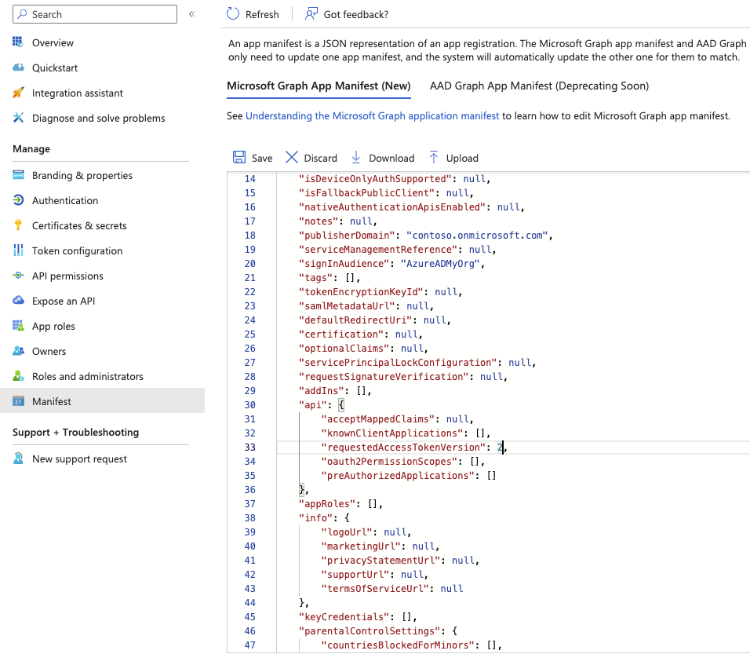

We'll need to create two application registrations for Azure AD authentication to cover both direct API
use and usage from the OpenAPI (swagger) documentation.

We'll start with the API.

## Backend API

### Step 1 - Create app registration
Head over to
[Azure -> Azure Active Directory -> App registrations](https://portal.azure.com/#blade/Microsoft_AAD_IAM/ActiveDirectoryMenuBlade/RegisteredApps),
and create a new registration.

Select a fitting name for your project; Azure will present the name to the user during consent.

* `Supported account types`: `Single tenant` -  If you want to create a multi-tenant application, you
should head over to the [multi-tenant documentation](../multi-tenant/azure_setup.mdx)

Press **Register**


### Step 2 - Change token version to `v2`

First we'll change the token version to version 2. In the left menu bar, click `Manifest` and find the line
that says `accessTokenAcceptedVersion`. Change its value from `null` to `2`.

Press **Save**

(This change can take some time to happen, which is why we do this first.)




### Step 3 - Note down your application IDs
Go back to the `Overview`, found in the left menu.

Copy the `Application (Client) ID` and `Directory (tenant) ID`, we'll need these for later. I like to use `.env` files to
store variables like these:

```bash title=".env" {1,2}
TENANT_ID=
APP_CLIENT_ID=
OPENAPI_CLIENT_ID=
````


### Step 4 - Add an application scope

1. Go to **Expose an API** in the left menu bar under your app registration.
2. Press **+ Add a scope**
3. You'll be prompted to set an Application ID URI, leave the suggested one and press **Save and continue**


Add a scope named `user_impersonation` that can be consented by `Admins and users`.

You can use the following descriptions:

```text
Access API as user
Allows the app to access the API as the user.

Access API as you
Allows the app to access the API as you.
```


## OpenAPI Documentation
Our OpenAPI documentation will use the `Authorization Code Grant Flow, with Proof Key for Code Exchange` flow.
It's a flow that enables a user of a Single-Page Application to safely log in, consent to permissions and fetch an `access_token`
in the `JWT` format. When the user clicks `Try out` on the APIs, the `access_token` is attached to the header as a `Bearer ` token.
This is the token the backend will validate.

So, let's set it up!

### Step 1 - Create app registration
Just like in the previous chapter, we have to create an application registration for our OpenAPI.

Head over to
[Azure -> Azure Active Directory -> App registrations](https://portal.azure.com/#blade/Microsoft_AAD_IAM/ActiveDirectoryMenuBlade/RegisteredApps),
and create a new registration.

Use the same name, but with `- OpenAPI` appended to it.

* `Supported account types`: `Single tenant`
* `Redirect URI`: Choose `Single-Page Application (SPA)` and `http://localhost:8000/oauth2-redirect` as a value

Press **Register**


### Step 2 - Change token version to `v2`

Like last time, we'll change the token version to version 2. In the left menu bar, click `Manifest` and find the line
that says `accessTokenAcceptedVersion`. Change its value from `null` to `2`.

Press **Save**


### Step 3 - Note down your application IDs
Go back to the `Overview`, found in the left menu.

Copy the `Application (Client) ID` and save it as your `OPENAPI_CLIENT_ID`:

```bash title=".env" {3}
TENANT_ID=
APP_CLIENT_ID=
OPENAPI_CLIENT_ID=
````


### Step 4 - Allow OpenAPI to talk to the backend

To allow OpenAPI to talk to the backend API, you must add API permissions to the OpenAPI app registration.
In the left menu, go to **API Permissions** and **Add a permission**.


Select the `user_impersonation` scope, and press **Add a permission**.

Your view should now look something like this:


That's it! Next step is to configure the FastAPI application.
