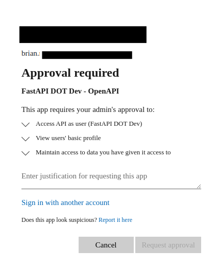

If you're met by this screen when attempting to log in:

Then please follow the steps provided in [issue 45](https://github.com/Intility/fastapi-azure-auth/issues/45):

1. Navigate to [Azure -> Azure Active Directory -> App registrations](https://portal.azure.com/#blade/Microsoft_AAD_IAM/ActiveDirectoryMenuBlade/RegisteredApps)
and find your backend application registration
2. Go to `Expose an API`
3. Under `Authorized client applications` click `Add a client application`
4. Add the client ID of your OpenAPI application registration (saved as `OPENAPI_CLIENT_ID` in your `.env` file)
5. Select the `api://<client id>/user_impersonation` checkbox
6. Click `Add Application`
