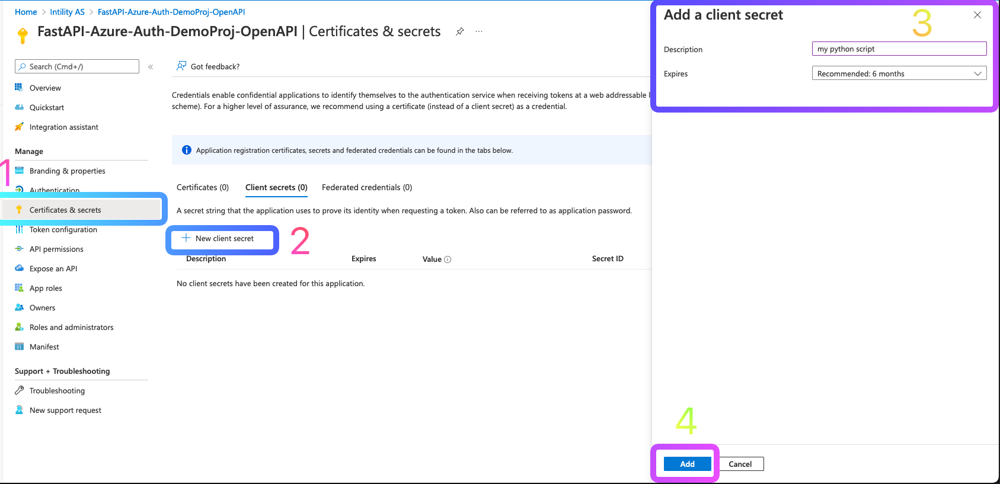
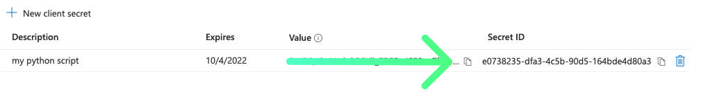

In order to call your APIs from Python (or any other backend), you should use the [Client Credential Flow](https://docs.microsoft.com/en-us/azure/active-directory/develop/v2-oauth2-client-creds-grant-flow).

1. Navigate to [Azure -> Azure Active Directory -> App registrations](https://portal.azure.com/#blade/Microsoft_AAD_IAM/ActiveDirectoryMenuBlade/RegisteredApps)
and find your **OpenAPI application registration***
2. Navigate over to `Certificate & secrets`
3. Click `New client secret`
4. Give it a name and an expiry time
5. Click `Add`

:::info
*In this example, we used the already created OpenAPI app registration in order to keep it short,
but in reality you should create a new app registration for _every_ application talking to your backend.
In other words, if someone wants to use your API, they should create their own app registration and their own secret.
:::




:::info
You can use client certificates too, but we won't cover this here.
:::

6. Copy the secret and save it for later.




7. Fetch the token from Azure, and then call your own API endpoint:

```python title="my_script.py"
from httpx import AsyncClient
from demo_project.core.config import settings

async with AsyncClient() as client:
    azure_response = await client.post(
        url=f'https://login.microsoftonline.com/{settings.TENANT_ID}/oauth2/v2.0/token',
        data={
            'grant_type': 'client_credentials',
            'client_id': settings.OPENAPI_CLIENT_ID,  # the ID of the app reg you created the secret for
            'client_secret': settings.CLIENT_SECRET,  # the secret you created
            'scope': f'api://{settings.APP_CLIENT_ID}/.default',  # note: NOT .user_impersonation
        }
    )
    token = azure_response.json()['access_token']

    my_api_response = await client.get(
        'http://localhost:8000/api/v1/hello-graph',
        headers={'Authorization': f'Bearer {token}'},
    )
    print(my_api_response.json())
```

:::info
If you install `ipython`  you can use `asyncio` code directly in your terminal.
(`poetry add ipython --dev`)
:::
