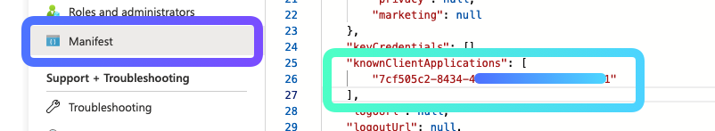
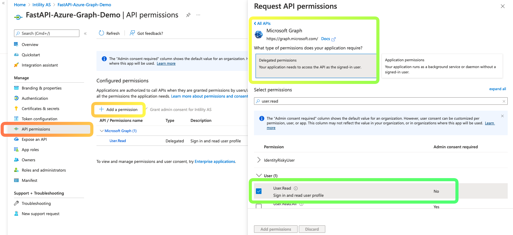
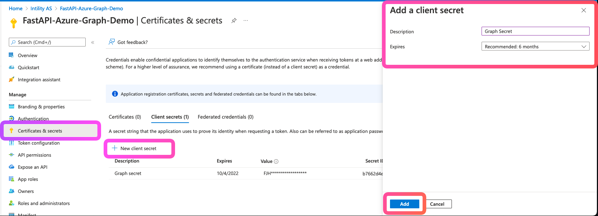
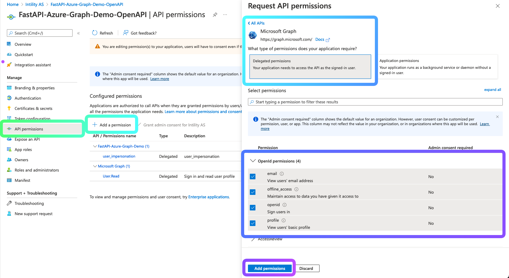

[Microsoft Graph](https://docs.microsoft.com/en-us/graph/overview) can be used together with the
[On Behalf Flow (OBO)](https://docs.microsoft.com/en-us/azure/active-directory/develop/v2-oauth2-on-behalf-of-flow),
but in order to make this work you must alter your app registration configuration a bit.

:::info
This documentation is based off [issue #40](https://github.com/Intility/fastapi-azure-auth/issues/40)
:::

### Backend API App Registration
1. Head over to [Azure -> Azure Active Directory -> App registrations](https://portal.azure.com/#blade/Microsoft_AAD_IAM/ActiveDirectoryMenuBlade/RegisteredApps),
and select your **Backend API** Application Registration
2. Navigate to the `Manifest` in the menu on the left
3. Add your OpenAPI/Swagger ClientID to the `knownClientApplications` (saved as `OPENAPI_CLIENT_ID` in your `.env`)

4. Select `API permissions` and ensure `User.Read` is there. If not, follow the steps in the picture below:
    1. `Add a permission`
    2. Select `Microsoft Graph` under `Microsoft APIs`
    3. Select `Delegated permissions`
    4. Search for and select `User.Read`
    5. Click add permission

5. Select `Certificates & Secrets` and create a secret for your backend to use in order to fetch a Graph token
    1. `New client secret`
    2. Give it a name
    3. Add

### OpenAPI App Registration

1. Head back to [Azure -> Azure Active Directory -> App registrations](https://portal.azure.com/#blade/Microsoft_AAD_IAM/ActiveDirectoryMenuBlade/RegisteredApps),
and select your **OpenAPI/Swagger** Application Registration
2. Select `API permissions` in the menu on the left
3. Add `email`, `offline_access`, `openid`, `profile` scopes
    1. `Add a permission`
    2. Select `Microsoft Graph` under `Microsoft APIs`
    3. Select `Delegated permissions`
    4. Select the permissions
    5. Click add permission

### Code
You can now fetch a graph token using the
[OBO flow](https://docs.microsoft.com/en-us/azure/active-directory/develop/v2-oauth2-on-behalf-of-flow).
A full code example of an API using Graph can be found in the
[demo project](https://github.com/Intility/fastapi-azure-auth/blob/main/demo_project/api/api_v1/endpoints/graph.py).
