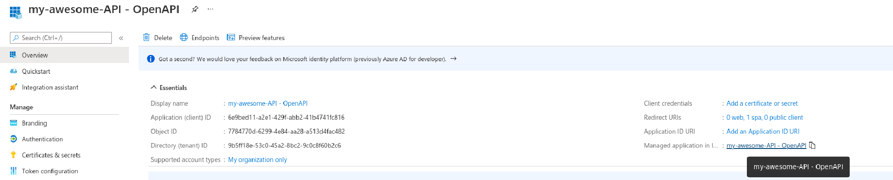

In ``FastAPI-Azure-Auth`` version 4 and above, guest users in single- and multi-tenant applications (not B2C) will no longer
be able to access your APIs by default. Most developers do not intend to give access to guest users which appear
in the tenant because of other applications (such as users invited into Teams channels), and this can lead to a security
concerns if not handled.

In single-tenant applications, it is recommended to deny the user on Azure login, instead of after they're calling the APIs,
please check out the [tutorial below](#user-assignment-required).
In multi-tenant applications, this can be hard to manage, as you'd have to fix this in every tenant.

If you want to allow guest users into your tenant, you can change the ``allow_guest_users`` setting to ``True``.
If you want to lock down a specific endpoint from guest users, you can do so by creating a
[dependency](#creating-a-dependency-in-code).

### User assignment required

Go to **all** your [Enterprise Applications](https://portal.azure.com/#blade/Microsoft_AAD_IAM/StartboardApplicationsMenuBlade/AllApps/menuId/)
and do the following steps. You can find your Enterprise Application either by searching on the Client ID in the
[Enterprise Applications](https://portal.azure.com/#blade/Microsoft_AAD_IAM/StartboardApplicationsMenuBlade/AllApps/menuId/) menu,
or by first navigating to your [App registration](https://portal.azure.com/#blade/Microsoft_AAD_IAM/ActiveDirectoryMenuBlade/RegisteredApps) and
clicking the `Managed application in local directory` link:



Under **Properties**, enable `User assignment required?` and **Save**.

Then, go to **Users and groups**, and **add user/group**. Find users or a fitting group and assign it to the role Default Access.


### Creating a dependency in code

Sometimes, especially for multi-tenant applications, doing in-code checks are beneficial. Please note that guest
users are denied by default, so you only need this if you configure ``allow_guest_users`` setting to ``True``, but
would like to lock down specific endpoints.

```python title="security.py"
from fastapi import Depends
from fastapi_azure_auth.exceptions import InvalidAuth
from fastapi_azure_auth.user import User

async def deny_guest_users(user: User = Depends(azure_scheme)) -> None:
    """
    Deny guest users
    """
    if user.is_guest:
        raise InvalidAuth('Guest user not allowed')
```


Alternatively, after [FastAPI 0.95.0](https://github.com/tiangolo/fastapi/releases/tag/0.95.0) you can create an
``Annotated`` dependency.

```python title="security.py"
from typing import Annotated
from fastapi import Depends
from fastapi_azure_auth.exceptions import InvalidAuth
from fastapi_azure_auth.user import User

async def deny_guest_users(user: User = Depends(azure_scheme)) -> None:
    """
    Deny guest users
    """
    if user.is_guest:
        raise InvalidAuth('Guest user not allowed')

NonGuestUser = Annotated[User, Depends(deny_guest_users)]
```
and in your view:

```python title="my_view.py"
@app.get("/items/")
def read_items(user: NonGuestUser):
    ...
```

:::note
You can configure the `acct` claim in AzureAD if you'd like a specific claim to indicate if the user
is a guest or tenant member
:::
