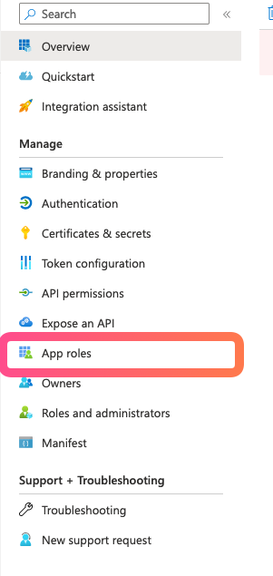
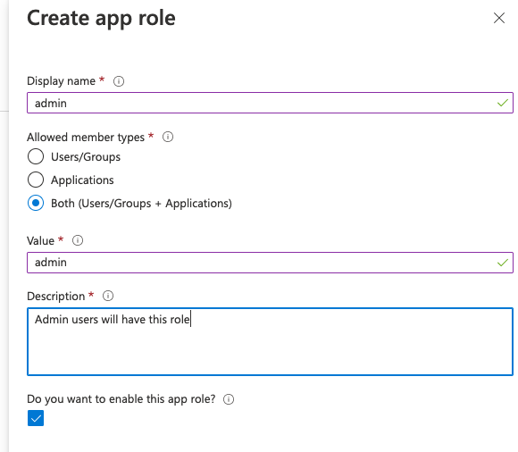
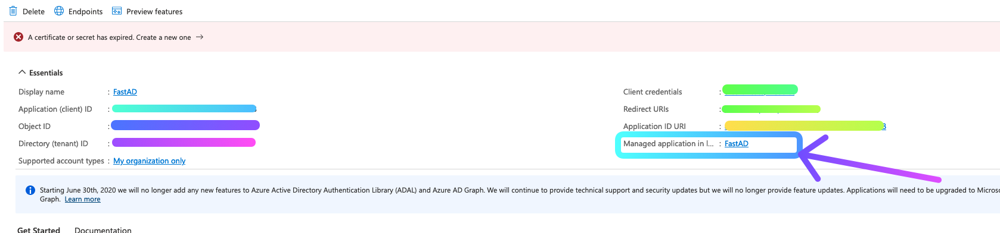
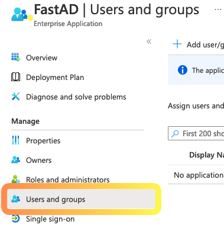
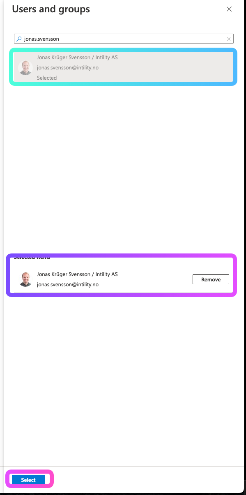
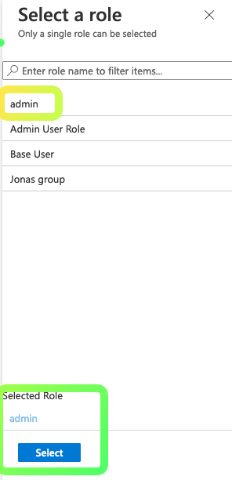

## Azure setup
Go to your application registration, click `Groups`:


Create a role:


Go to Overview and click the Enterprise application link:


Go to `Users and groups` and add a user/group:


Add the user/group that you want to have this role (if you use a group, the users must be a direct member of that group. Nested membership does not work):


Click `select role` and assign the user/role to your application role:


Finish by clicking `Assign`. The user will now have that group in their token.

## App code

You can lock down on roles by creating your own wrapper dependency:

```python title="dependencies.py"
from fastapi import Depends
from fastapi_azure_auth.exceptions import InvalidAuth
from fastapi_azure_auth.user import User

async def validate_is_admin_user(user: User = Depends(azure_scheme)) -> None:
    """
    Validate that a user is in the `AdminUser` role in order to access the API.
    Raises a 401 authentication error if not.
    """
    if 'AdminUser' not in user.roles:
        raise InvalidAuth('User is not an AdminUser')
```

and then use this dependency over `azure_scheme`.


Alternatively, after [FastAPI 0.95.0](https://github.com/tiangolo/fastapi/releases/tag/0.95.0) you can create an
``Annotated`` dependency.

```python title="security.py"
from typing import Annotated
from fastapi import Depends
from fastapi_azure_auth.exceptions import InvalidAuth
from fastapi_azure_auth.user import User

async def validate_is_admin_user(user: User = Depends(azure_scheme)) -> None:
    """
    Validate that a user is in the `AdminUser` role in order to access the API.
    Raises a 401 authentication error if not.
    """
    if 'AdminUser' not in user.roles:
        raise InvalidAuth('User is not an AdminUser')

AdminUser = Annotated[User, Depends(validate_is_admin_user)]
```
and in your view:

```python title="my_view.py"
@app.get("/items/")
def read_items(user: AdminUser):
    ...
```
